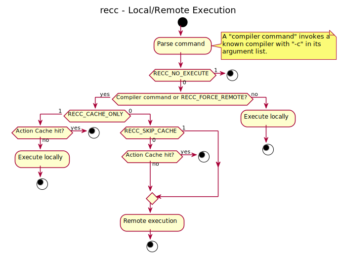

 .. _recc-running:

Running recc
------------

``recc`` is a command-line utility that runs compile commands on a
Remote Execution server. To run it, you'll first need to set up an
execution server for it to talk to. Then, set the appropriate
configuration options and call ``recc`` with a compile command.

Setting up a Remote Execution server
~~~~~~~~~~~~~~~~~~~~~~~~~~~~~~~~~~~~

``recc`` should be compatible with any server that implements Bazel's
`Remote Execution API <https://github.com/bazelbuild/remote-apis>`__ V2.
It is primarily tested against `BuildGrid <http://buildgrid.build/>`__,
so follow the instructions there to start a server.

The `Bazel Buildfarm <https://github.com/bazelbuild/bazel-buildfarm>`__
project is also working on a Remote Execution server, but at time of
writing it uses version 1 of the API and so cannot be used with
``recc``.

Worker
^^^^^^

You'll also need to set up a build worker to actually run the build jobs
you submit. BuildGrid provides one you can use.

This repository used to contain a reference worker called
``reccworker``, but that has since been deprecated and removed. Some
examples of workers are:
`buildbox-worker <https://gitlab.com/BuildGrid/buildbox/buildbox-worker>`__,
`bgd-bot <https://gitlab.com/BuildGrid/buildgrid>`__

Configuration
~~~~~~~~~~~~~

``recc``\ ’s default behavior can be overridden by configuration file
settings, which in turn can be overridden by environment variables with
names starting with ``RECC_``. ``recc`` by default reads configuration
options from the following places, applying settings bottom-up, with 1
being the last applied configuration (i.e. if an option is set in
multiple files, the one higher on this list will be the effective one):

1) Environment variables

2) ``${cwd}/recc/recc.conf``

3) ``{$RECC_CONFIG_DIRECTORY}/recc.conf`` can be specified with the RECC_CONFIG_DIRECTORY
   environment variable

4) ``~/.recc/recc.conf``

5) ``${RECC_CONFIG_PREFIX_DIR}/recc.conf`` when specified at compile
   time with ``-DRECC_CONFIG_PREFIX_DIR=/path/to/custom/prefix``

6) ``${INSTALL_DIR}/../etc/recc/recc.conf``

A full list of configuration variables is detailed on :ref:`RECC Configuration Variables`.

Log messages
^^^^^^^^^^^^

By default recc will only print log messages to stderr if they contain
errors. This prevents tainting stdout/err when an execution succeeds
(i.e. they will only contain the contents written by the command).

For more verbosity, ``RECC_LOG_LEVEL`` allows setting the maximum level
of messages displayed (see ``recc --help`` for the list of supported
levels).

Setting ``RECC_LOG_VERBOSE=1`` is equivalent to
``RECC_LOG_LEVEL=debug``.

Configuration File Syntax
^^^^^^^^^^^^^^^^^^^^^^^^^

Configuration files are in a simple “key=value” format, one setting per
line. Lines starting with a hash sign are comments. Blank lines are
ignored.

At minimum, you'll need to set ``RECC_SERVER`` to the URI of your
Remote:

::

      # set execution server to http://localhost:12345
      server=http://localhost:12345

Map configuration variables can be set similarly

::

      # set OS and compiler architecture targets for remote build.
      remote_platform_OSFamily=linux
      remote_platform_arch=x86_64

For a full list of the environment/configuration variables ``recc``
accepts and what they do, run ``recc --help`` or see :ref:`RECC Configuration Variables`.

If variables are specified in the configuration file, the prefix
**RECC\_** should not be included.

Environment Variables
^^^^^^^^^^^^^^^^^^^^^

If you'd like to set environment variables, an example is specified
below:

.. code:: sh

    $ export RECC_SERVER=localhost:12345

You may also want to set ``RECC_VERBOSE=1`` to enable verbose output.

Support for dependency path replacement.
^^^^^^^^^^^^^^^^^^^^^^^^^^^^^^^^^^^^^^^^

A common problem that can hinder reproducibility and cacheabilty of
remote builds, are dependencies that are local to the user, system, and
set of machines the build command is sent from. To solve this issue,
``recc`` supports specifying the ``RECC_PREFIX_MAP`` configuration
variable, allowing changing a prefix in a path, with another one. For
example, replacing all paths with prefixes including ``/usr/local/bin``
with ``/usr/bin`` can be done by specifying:

.. code:: sh

    export RECC_PREFIX_MAP=/usr/local/bin=/usr/bin

Supports multiple prefixes by specifying ``:`` as a delimiter.

Guidelines for replacement are: 1. Both keys/values for
RECC\_PREFIX\_MAP must be absolute paths. 2. Prefix candidates are
matched from left to right, and once a match is found it is replaced and
no more prefix replacement is done. 3. Path prefix replacement happens
before absolute to relative path conversion.

Support for dependency filtering
^^^^^^^^^^^^^^^^^^^^^^^^^^^^^^^^

When using ``RECC_DEPS_GLOBAL_PATHS``, paths to system files
(/usr/include, /opt/rh/devtoolset-7, etc) are included as part of the
input root. To avoid these system dependencies potential conflicting
with downstream build environment dependencies, there is now a method to
filter out dependencies based on a set of paths. Setting the
``RECC_DEPS_EXCLUDE_PATHS`` environment variable with a comma-delimited
set of paths(used as path prefixes) will be used as a filter to exclude
those dependencies:

.. code:: sh

    export RECC_DEPS_EXCLUDE_PATHS=/usr/include,/opt/rh/devtoolset-7

Running ``recc`` against Google's RBE (Remote Build Execution) API
~~~~~~~~~~~~~~~~~~~~~~~~~~~~~~~~~~~~~~~~~~~~~~~~~~~~~~~~~~~~~~~~~~

*NOTE:* At time of writing, RBE is still in alpha and instructions are
subject to change

To run ``recc`` against Google's RBE instead of a self hosted Remote
Execution Server, the following options need to be set: \*
``RECC_SERVER_AUTH_GOOGLEAPI=1`` to enable using Google's default
authentication \*
``RECC_INSTANCE=projects/<project_ID>/instances/default_instance`` Where
is the id of your Google Cloud Platform project \*
``RECC_SERVER=remotebuildexecution.googleapis.com`` \*
``RECC_REMOTE_PLATFORM_CONTAINER_IMAGE=docker://gcr.io/cloud-marketplace/...``
The Docker image from google's cloud registry for the worker to run in

You will also need to be authenticated with GCP, which can happen
several ways. See https://cloud.google.com/docs/authentication/ for
instructions on how to do that.

Calling ``recc`` with a compile command
~~~~~~~~~~~~~~~~~~~~~~~~~~~~~~~~~~~~~~~

Once you've started the server and set the environment variables, you're
ready to call ``recc`` with a compile command:

.. code:: sh

    $ recc /usr/bin/gcc -c hello.c -o hello.o

``recc`` only supports compilation, not linking, so be sure to include
the ``-c`` argument in your command. If ``recc`` doesn't think your
command is a compile command, it'll just run it locally:

.. code:: sh

    $ recc /usr/bin/echo hello
    hello
    $ RECC_VERBOSE=1 recc /usr/bin/echo hello
    Not a compiler command, so running locally.
    (use RECC_FORCE_REMOTE=1 to force remote execution)
    hello
    $

Local/Remote Execution
~~~~~~~~~~~~~~~~~~~~~~
The flowchart below shows how recc decides whether to invoke the command
locally or issue a remote execution request.

